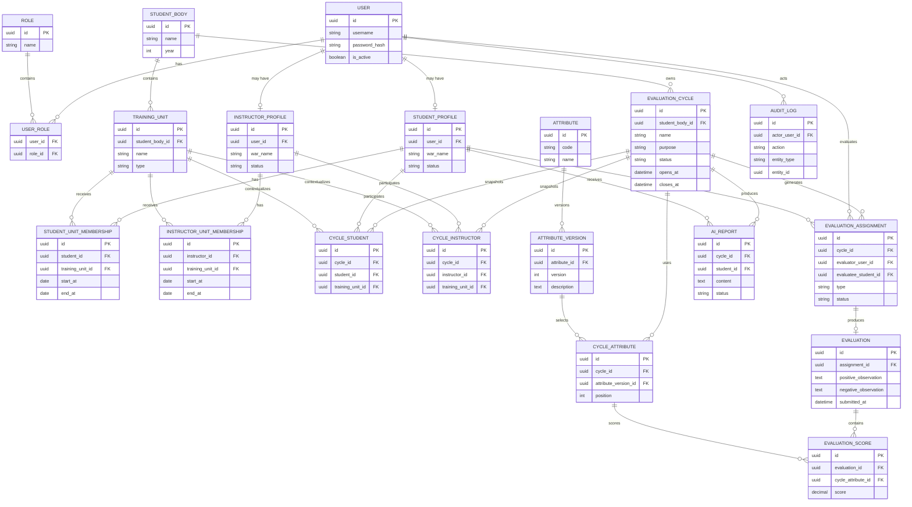

# SISADA — Modelo de Dados

**Documento:** `03-data-model.md`  
**Versão:** 0.1  
**Status:** DRAFT — base para implementação com PostgreSQL + SQLAlchemy  
**Dependências:** `01-product-requirements.md`, `02-domain-rules.md`

---

# 1. Objetivo

Este documento transforma as regras de domínio do SISADA em um modelo relacional inicial.

O foco desta versão é definir:

- entidades;
- responsabilidades;
- primary keys;
- foreign keys;
- cardinalidades;
- constraints;
- índices;
- dados persistidos x dados derivados.

O modelo ainda poderá mudar antes da primeira migration.

---

# 2. Princípios adotados

## 2.1 UUID como identificador técnico

As entidades principais utilizarão UUID como chave primária.

Exemplo:

```text
id UUID PRIMARY KEY
```

Motivos:

- identificadores não sequenciais na API;
- facilidade para gerar IDs na aplicação;
- menor acoplamento a um banco específico em integrações futuras.

UUID **não substitui** constraints de unicidade.

---

## 2.2 Histórico não será sobrescrito quando houver mudança organizacional

Aluno e instrutor podem mudar de unidade.

Portanto, não utilizaremos apenas:

```text
student.training_unit_id
```

como fonte histórica.

Serão utilizadas tabelas de membership.

---

## 2.3 Avaliação e nota são entidades diferentes

`Evaluation` representa o ato de avaliação.

`EvaluationScore` representa a nota atribuída a um atributo específico.

Isso evita colunas rígidas como:

```text
evaluation.cooperation
evaluation.courage
evaluation.zeal
```

---

## 2.4 Analytics são inicialmente derivados

Não serão persistidos como fonte da verdade:

- média dos pares;
- gap SELF x PEER;
- distância euclidiana;
- média geral.

Eles serão calculados a partir das avaliações válidas.

Snapshots poderão ser adicionados no futuro para publicação, cache ou auditoria.

---

# 3. Visão organizacional

A estrutura desejada é:

```text
StudentBody
    │
    ├── TrainingUnit(type=PLATOON)
    │
    └── TrainingUnit(type=COURSE)
```

Exemplo:

```text
Corpo de Alunos
    ├── 1º Pelotão
    ├── 2º Pelotão
    ├── 3º Pelotão
    └── Curso de Comunicações
```

O aluno pode pertencer inicialmente ao `3º Pelotão` e depois ser transferido para `Curso de Comunicações`.

Ambos são `TrainingUnit`; muda o `type`.

Essa solução evita criar duas estruturas quase idênticas para Pelotão e Curso.

---

# 4. Entidades

# 4.1 User

Representa uma identidade autenticável.

```text
users
--------------------------------
id                 UUID PK
username           VARCHAR UNIQUE
email              VARCHAR NULL/UNIQUE
password_hash      VARCHAR
is_active          BOOLEAN
created_at         TIMESTAMP
updated_at         TIMESTAMP
```

Não deverá conter dados específicos de aluno ou instrutor.

---

# 4.2 Role

Papéis de autorização.

```text
roles
--------------------------------
id                 UUID PK
name               VARCHAR UNIQUE
```

Valores iniciais:

```text
STUDENT
INSTRUCTOR
ADMIN
```

## UserRole — decisão provisória

A recomendação é:

```text
User N ---- N Role
```

utilizando:

```text
user_roles
--------------------------------
user_id            UUID FK
role_id            UUID FK

PK(user_id, role_id)
```

### PENDENTE

O usuário ainda precisa confirmar se uma pessoa poderá possuir simultaneamente mais de um papel.

Se a resposta for `não`, este relacionamento poderá ser simplificado.

---

# 4.3 StudentProfile

Dados específicos do aluno.

```text
student_profiles
--------------------------------
id                 UUID PK
user_id            UUID FK UNIQUE
registration_no    VARCHAR NULL
war_name           VARCHAR
full_name          VARCHAR
status             ENUM
created_at         TIMESTAMP
updated_at         TIMESTAMP
```

Status inicial:

```text
ACTIVE
INACTIVE
```

Cardinalidade:

```text
User 1 ---- 0..1 StudentProfile
```

---

# 4.4 InstructorProfile

Dados específicos do instrutor.

```text
instructor_profiles
--------------------------------
id                 UUID PK
user_id            UUID FK UNIQUE
war_name           VARCHAR
full_name          VARCHAR
status             ENUM
created_at         TIMESTAMP
updated_at         TIMESTAMP
```

Cardinalidade:

```text
User 1 ---- 0..1 InstructorProfile
```

---

# 4.5 StudentBody

Representa o Corpo de Alunos.

```text
student_bodies
--------------------------------
id                 UUID PK
name               VARCHAR
year               INTEGER NULL
is_active          BOOLEAN
created_at         TIMESTAMP
```

Exemplo:

```text
Corpo de Alunos / 2027
```

---

# 4.6 TrainingUnit

Representa os agrupamentos subordinados ao Corpo de Alunos.

```text
training_units
--------------------------------
id                 UUID PK
student_body_id    UUID FK
name               VARCHAR
type               ENUM
is_active          BOOLEAN
created_at         TIMESTAMP
updated_at         TIMESTAMP
```

Tipos iniciais:

```text
PLATOON
COURSE
```

Constraint recomendada:

```text
UNIQUE(student_body_id, name)
```

Cardinalidade:

```text
StudentBody 1 ---- N TrainingUnit
```

---

# 4.7 StudentUnitMembership

Preserva o histórico de pertencimento do aluno.

```text
student_unit_memberships
--------------------------------
id                 UUID PK
student_id         UUID FK
training_unit_id   UUID FK
start_at           TIMESTAMP/DATE
end_at             TIMESTAMP/DATE NULL
created_at         TIMESTAMP
```

Cardinalidades:

```text
StudentProfile 1 ---- N StudentUnitMembership
TrainingUnit   1 ---- N StudentUnitMembership
```

Regra:

```text
end_at IS NULL
```

representa o vínculo atual.

## Constraint de domínio

Um aluno não poderá possuir dois memberships ativos simultaneamente.

Isso pode ser protegido no PostgreSQL por índice único parcial ou pela camada de aplicação + constraint apropriada.

---

# 4.8 InstructorUnitMembership

Mesmo conceito para instrutor.

```text
instructor_unit_memberships
--------------------------------
id                 UUID PK
instructor_id      UUID FK
training_unit_id   UUID FK
start_at           TIMESTAMP/DATE
end_at             TIMESTAMP/DATE NULL
created_at         TIMESTAMP
```

Regra:

um instrutor poderá possuir apenas um membership ativo por vez.

Uma `TrainingUnit` poderá possuir vários instrutores ativos.

---

# 5. Ciclo de avaliação

# 5.1 EvaluationCycle

Representa uma janela institucional de avaliação.

```text
evaluation_cycles
--------------------------------
id                 UUID PK
student_body_id    UUID FK
name               VARCHAR
purpose            ENUM
status             ENUM
opens_at           TIMESTAMP
closes_at          TIMESTAMP
created_by         UUID FK -> users
created_at         TIMESTAMP
updated_at         TIMESTAMP
closed_at          TIMESTAMP NULL
published_at       TIMESTAMP NULL
```

`purpose` inicial:

```text
FORMATIVE
SUMMATIVE
DEVELOPMENT_CHECKIN    # se futuramente aprovado no escopo
```

`status`:

```text
DRAFT
SCHEDULED
OPEN
CLOSED
PROCESSING
PUBLISHED
ARCHIVED
```

Constraints:

```text
closes_at > opens_at
```

---

# 5.2 EvaluationCycleType

Um ciclo pode habilitar vários tipos de avaliação.

Como SELF, PEER e VERTICAL não são mutuamente exclusivos, não devemos armazenar apenas:

```text
evaluation_cycle.type
```

A relação correta é N:N conceitualmente.

```text
evaluation_cycle_types
--------------------------------
cycle_id            UUID FK
evaluation_type     ENUM

PK(cycle_id, evaluation_type)
```

Valores:

```text
SELF
PEER
VERTICAL
```

Assim um ciclo pode possuir:

```text
SELF       ✓
PEER       ✓
VERTICAL   ✓
```

---

# 6. Snapshot do ciclo

Esta parte é crítica.

Se os memberships atuais forem usados diretamente, uma mudança de pelotão no meio do ciclo modificaria retroativamente quem deveria avaliar quem.

Por isso o ciclo deverá congelar seu contexto.

# 6.1 CycleStudent

```text
cycle_students
--------------------------------
id                 UUID PK
cycle_id           UUID FK
student_id         UUID FK
training_unit_id   UUID FK
is_active          BOOLEAN
created_at         TIMESTAMP
```

Constraint:

```text
UNIQUE(cycle_id, student_id)
```

O `training_unit_id` registra em qual unidade o aluno estava para aquele ciclo.

---

# 6.2 CycleInstructor

```text
cycle_instructors
--------------------------------
id                 UUID PK
cycle_id           UUID FK
instructor_id      UUID FK
training_unit_id   UUID FK
is_active          BOOLEAN
created_at         TIMESTAMP
```

Constraint:

```text
UNIQUE(cycle_id, instructor_id)
```

Assim, se o instrutor mudar de unidade depois, suas obrigações daquele ciclo não mudam.

---

# 7. Atributos de avaliação

# 7.1 Attribute

Catálogo lógico.

```text
attributes
--------------------------------
id                 UUID PK
code               VARCHAR UNIQUE
name               VARCHAR
is_active          BOOLEAN
created_at         TIMESTAMP
```

Valores iniciais:

```text
PRESENTATION
COOPERATION
COURAGE
PERSISTENCE
EMOTIONAL_BALANCE
ZEAL
```

---

# 7.2 AttributeVersion

Descrição/critério versionado.

```text
attribute_versions
--------------------------------
id                 UUID PK
attribute_id       UUID FK
version            INTEGER
description        TEXT
created_at         TIMESTAMP
```

Constraint:

```text
UNIQUE(attribute_id, version)
```

Motivo:

se a definição pedagógica de `COOPERATION` mudar em 2029, uma avaliação de 2027 deve continuar apontando para o critério de 2027.

---

# 7.3 CycleAttribute

Define quais versões de atributos serão utilizadas no ciclo.

```text
cycle_attributes
--------------------------------
id                   UUID PK
cycle_id             UUID FK
attribute_version_id UUID FK
position             INTEGER
is_required          BOOLEAN
```

Constraints:

```text
UNIQUE(cycle_id, attribute_version_id)
UNIQUE(cycle_id, position)
```

SELF, PEER e VERTICAL utilizarão o mesmo conjunto do ciclo para preservar comparabilidade.

---

# 8. Atribuições

# 8.1 EvaluationAssignment

Representa a obrigação de avaliar.

```text
evaluation_assignments
--------------------------------
id                 UUID PK
cycle_id           UUID FK
type               ENUM
evaluator_user_id  UUID FK -> users
evaluatee_student_id UUID FK -> student_profiles
status             ENUM
created_at         TIMESTAMP
cancelled_at       TIMESTAMP NULL
cancel_reason      TEXT NULL
```

`type`:

```text
SELF
PEER
VERTICAL
```

`status`:

```text
ASSIGNED
IN_PROGRESS
SUBMITTED
CANCELLED
LOCKED
```

## Unicidade

```text
UNIQUE(
    cycle_id,
    type,
    evaluator_user_id,
    evaluatee_student_id
)
```

Isso impede duplicações.

---

# 8.2 Regras de geração de assignments

## SELF

Para cada `CycleStudent`:

```text
Aluno A -> Aluno A
```

1 assignment.

---

## PEER

Para cada unidade do snapshot:

se existem `N` alunos:

```text
N * (N - 1)
```

assignments.

Exemplo com três alunos:

```text
A -> B
A -> C

B -> A
B -> C

C -> A
C -> B
```

Não existe:

```text
A -> A
```

como PEER.

---

## VERTICAL

Todos os instrutores da unidade no snapshot avaliam todos os alunos da mesma unidade.

Se:

```text
I = quantidade de instrutores
N = quantidade de alunos
```

a quantidade será:

```text
I * N
```

Exemplo:

```text
Instrutor A -> Aluno 1
Instrutor A -> Aluno 2

Instrutor B -> Aluno 1
Instrutor B -> Aluno 2
```

---

# 9. Avaliação

# 9.1 Evaluation

Representa o conteúdo preenchido para uma assignment.

```text
evaluations
--------------------------------
id                    UUID PK
assignment_id         UUID FK UNIQUE
positive_observation  TEXT NULL
negative_observation  TEXT NULL
created_at            TIMESTAMP
updated_at            TIMESTAMP
submitted_at          TIMESTAMP NULL
```

Cardinalidade:

```text
EvaluationAssignment 1 ---- 0..1 Evaluation
```

Um assignment ainda não iniciado pode não possuir `Evaluation`.

---

# 9.2 EvaluationScore

```text
evaluation_scores
--------------------------------
id                   UUID PK
evaluation_id        UUID FK
cycle_attribute_id   UUID FK
score                NUMERIC(5,3)
created_at           TIMESTAMP
updated_at           TIMESTAMP
```

Constraints:

```text
UNIQUE(evaluation_id, cycle_attribute_id)

CHECK(score >= 0.000)
CHECK(score <= 10.000)
```

Por que `NUMERIC(5,3)`?

```text
10.000
```

possui até 5 dígitos totais com 3 casas decimais.

Não usar `FLOAT` como tipo de persistência da nota.

---

# 10. Relatórios de IA

# 10.1 AIReport

```text
ai_reports
--------------------------------
id                 UUID PK
cycle_id           UUID FK
student_id         UUID FK
status             ENUM
content            TEXT
model_name         VARCHAR NULL
prompt_version     VARCHAR NULL
generated_at       TIMESTAMP
approved_at        TIMESTAMP NULL
approved_by        UUID FK -> users NULL
created_at         TIMESTAMP
updated_at         TIMESTAMP
```

Status:

```text
DRAFT
APPROVED
REJECTED
```

Constraint recomendada:

uma política futura decidirá se haverá uma ou várias versões por aluno/ciclo.

A primeira implementação pode permitir várias gerações e apenas uma versão aprovada.

---

# 11. AuditLog

```text
audit_logs
--------------------------------
id                 UUID PK
actor_user_id      UUID FK NULL
action             VARCHAR
entity_type        VARCHAR
entity_id          UUID NULL
metadata           JSONB NULL
created_at         TIMESTAMP
```

Uso inicial:

- login administrativo;
- fechamento de ciclo;
- reabertura futura;
- cancelamento de assignment;
- alteração de membership;
- acesso a comentário lateral identificado;
- geração/aprovação de relatório.

Não será utilizado para versionar cada alteração de score antes do fechamento.

---

# 12. Dados derivados

Não serão inicialmente tabelas de fonte da verdade.

## Média PEER por atributo

```text
AVG(EvaluationScore.score)
```

filtrando:

```text
assignment.type = PEER
assignment.status IN (SUBMITTED, LOCKED)
assignment.status != CANCELLED
```

---

## Gap SELF x PEER

Para atributo `i`:

```text
gap_i = self_score_i - peer_mean_i
```

---

## Distância Euclidiana

```text
sqrt(
    Σ (self_score_i - peer_mean_i)^2
)
```

A distância não será armazenada inicialmente.

### Motivo

Se uma avaliação for editada durante o ciclo:

```text
score muda
```

o valor derivado precisa mudar junto.

Calcular a partir da fonte evita inconsistência.

Após publicação, poderemos avaliar snapshots analíticos se houver necessidade de performance ou congelamento institucional.

---

# 13. Cardinalidades resumidas

```text
StudentBody
    1
    |
    N
TrainingUnit

StudentProfile
    1
    |
    N
StudentUnitMembership
    N
    |
    1
TrainingUnit

InstructorProfile
    1
    |
    N
InstructorUnitMembership
    N
    |
    1
TrainingUnit

EvaluationCycle
    1
    |
    N
CycleStudent

EvaluationCycle
    1
    |
    N
CycleInstructor

EvaluationCycle
    1
    |
    N
EvaluationAssignment

EvaluationAssignment
    1
    |
   0..1
Evaluation

Evaluation
    1
    |
    N
EvaluationScore

CycleAttribute
    1
    |
    N
EvaluationScore
```

---

# 14. Primeiro DER



---

# 15. Constraints críticas que deverão existir também no banco

A aplicação validará regras, mas regras estruturais importantes não devem depender somente de Python.

## EvaluationScore

```text
UNIQUE(evaluation_id, cycle_attribute_id)
CHECK(score >= 0)
CHECK(score <= 10)
```

## EvaluationAssignment

```text
UNIQUE(cycle_id, type, evaluator_user_id, evaluatee_student_id)
```

## CycleStudent

```text
UNIQUE(cycle_id, student_id)
```

## CycleInstructor

```text
UNIQUE(cycle_id, instructor_id)
```

## AttributeVersion

```text
UNIQUE(attribute_id, version)
```

## Membership ativo

Deverá existir no máximo um membership ativo por aluno/instrutor.

---

# 16. Regras que não cabem apenas em constraint SQL

Algumas invariantes dependem de entidades relacionadas.

Exemplos:

```text
PEER -> evaluator != evaluatee
SELF -> evaluator == evaluatee
VERTICAL -> evaluator precisa ser instrutor
PEER -> evaluator precisa ser aluno
SELF -> evaluator precisa ser o usuário do StudentProfile avaliado
```

Essas regras ficarão principalmente no domínio/service layer e terão testes de integração.

Podemos posteriormente reforçar algumas com triggers, mas isso não é necessário no MVP.

---

# 17. Decisão importante: EvaluationAssignment

Poderíamos eliminar `EvaluationAssignment` e criar diretamente avaliações.

Não faremos isso.

Ela resolve vários problemas:

```text
Quem ainda precisa avaliar?
Quem concluiu?
Quem foi dispensado?
Qual é o denominador do progresso?
Qual obrigação foi cancelada?
```

Exemplo:

```text
100 assignments
92 SUBMITTED
5 ASSIGNED
3 CANCELLED
```

Sem `EvaluationAssignment`, calcular pendências fica muito mais confuso.

---

# 18. Decisão importante: snapshot do ciclo

`CycleStudent` e `CycleInstructor` parecem duplicação de dados.

Não são.

Eles preservam o contexto temporal.

Exemplo:

```text
01 MAR
Aluno A -> 3º Pelotão

05 MAR
Ciclo aberto

15 MAR
Aluno A -> Curso Comunicações
```

O ciclo de 05 MAR continua enxergando:

```text
Aluno A -> 3º Pelotão
```

porque foi esse o contexto congelado.

Um ciclo novo poderá enxergar:

```text
Aluno A -> Curso Comunicações
```

---

# 19. Questões pendentes

## DM-001 — múltiplos papéis

Confirmar se um mesmo usuário poderá possuir:

```text
INSTRUCTOR + ADMIN
```

Se sim, manter `UserRole`.

## DM-002 — dados cadastrais militares

Definir posteriormente os campos realmente necessários no perfil:

- número;
- nome de guerra;
- posto/graduação;
- arma/quadro/serviço;
- identidade militar;
- outros.

Não devemos armazenar dados pessoais apenas porque “podem ser úteis”.

## DM-003 — exclusão

Registros históricos como avaliações, memberships, cycles e reports não deverão utilizar hard delete no fluxo comum.

A política será detalhada em segurança/retention.

---

# 20. Próxima etapa

```text
01-product-requirements.md  ✅
02-domain-rules.md          ✅ v0.2
03-data-model.md            ✅ v0.1
04-architecture.md          <- próximo
05-backlog.md
```

Antes da primeira migration, este modelo deverá passar por uma última revisão após a definição da arquitetura.
