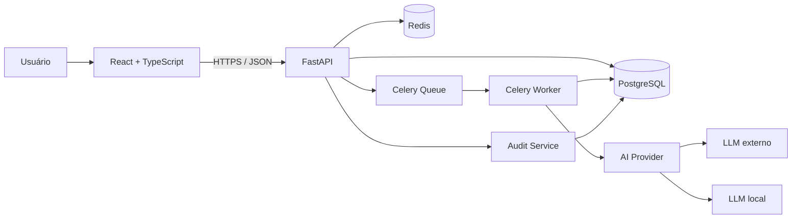
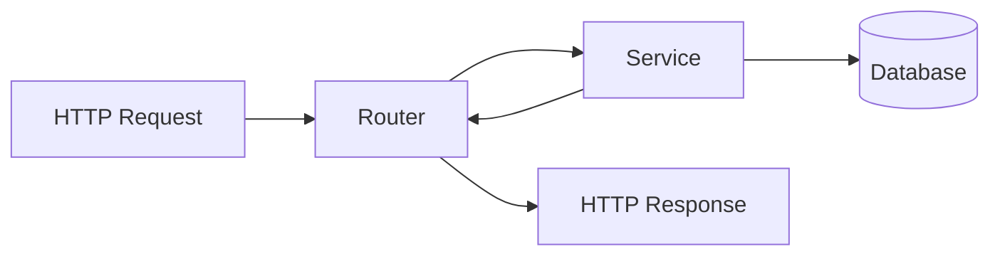
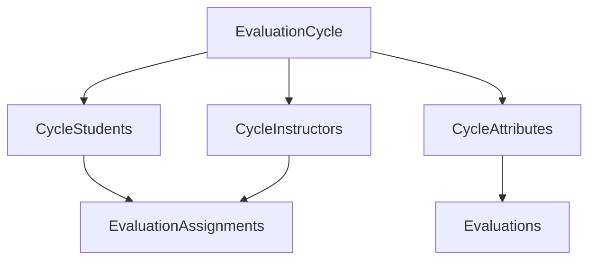
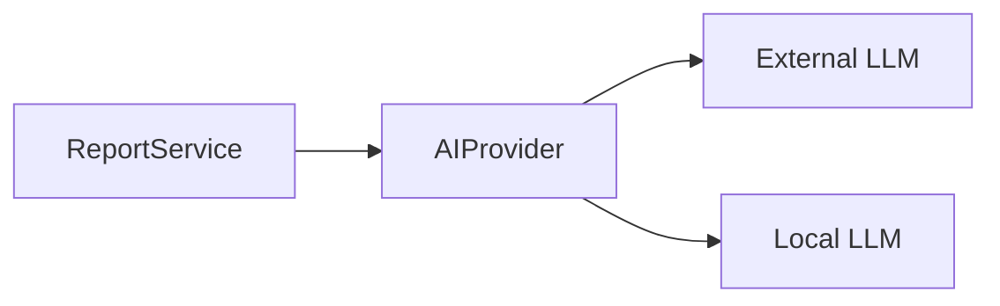
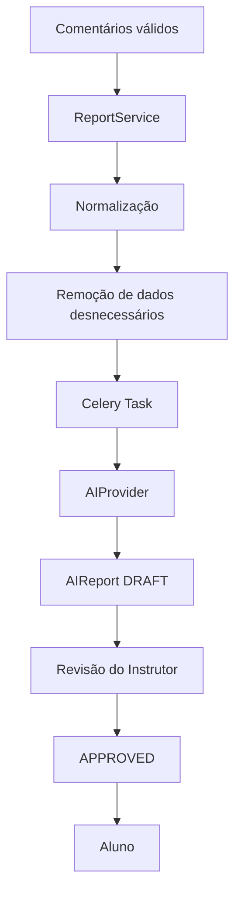
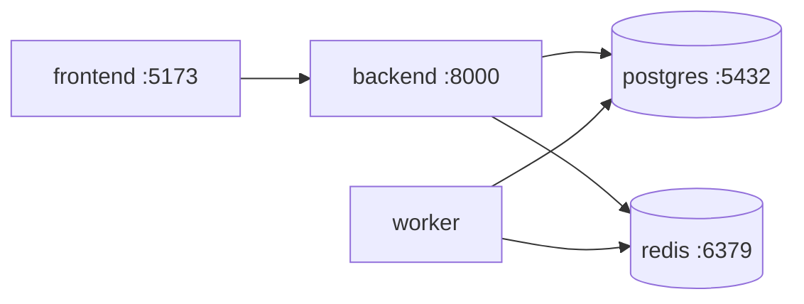

# SISADA — Arquitetura de Software

**Documento:** `04-architecture.md`  
**Versão:** 0.1  
**Status:** DRAFT — arquitetura-base para o MVP  
**Dependências:** `01-product-requirements.md`, `02-domain-rules.md`, `03-data-model.md`

---

# 1. Objetivo

Este documento define como os componentes técnicos do SISADA serão organizados e como irão se comunicar.

Objetivos principais:

- manter arquitetura compreensível para um projeto individual;
- permitir crescimento sem reescrita estrutural;
- separar responsabilidades;
- favorecer testes;
- preservar segurança e rastreabilidade;
- permitir uso de IA sem acoplar o domínio a um fornecedor;
- gerar um projeto de portfólio tecnicamente defensável.

---

# 2. Decisão arquitetural principal

O SISADA será desenvolvido inicialmente como um:

```text
MODULAR MONOLITH
```

Ou seja:

- um único backend FastAPI;
- um único banco PostgreSQL;
- módulos internos bem separados;
- deploy simples;
- sem microserviços no MVP.

Motivo:

microserviços aumentariam complexidade de rede, observabilidade, deploy, consistência transacional e DevOps sem trazer benefício proporcional ao tamanho atual do produto.

---

# 3. Stack principal

## Frontend

```text
React
TypeScript
Vite
React Router
TanStack Query
React Hook Form
Zod
Tailwind CSS
shadcn/ui
Recharts
```

## Backend

```text
Python
FastAPI
Pydantic
SQLAlchemy 2.x
Alembic
PostgreSQL
Redis
Celery
Pytest
```

## Infraestrutura

```text
Docker
Docker Compose
Git
GitHub
GitHub Actions
Nginx (produção, posteriormente)
```

---

# 4. Visão geral



---

# 5. Responsabilidade de cada componente

## 5.1 React

Responsável por:

- interface;
- navegação;
- formulários;
- estado visual;
- chamadas HTTP;
- gráficos;
- experiência do usuário.

React **não contém regras oficiais do domínio**.

Exemplo incorreto:

```text
Frontend decide se instrutor pode avaliar aluno.
```

Exemplo correto:

```text
Frontend esconde/desabilita ação por UX
+
Backend valida autorização de verdade.
```

---

## 5.2 FastAPI

É a camada central da aplicação.

Responsável por:

- API REST;
- autenticação;
- autorização;
- regras de negócio;
- validação de entrada;
- persistência;
- geração de assignments;
- cálculo de analytics;
- coordenação de relatórios;
- auditoria.

---

## 5.3 PostgreSQL

Será a fonte da verdade para:

- usuários;
- perfis;
- unidades;
- memberships;
- ciclos;
- assignments;
- avaliações;
- scores;
- relatórios;
- logs de auditoria.

Não usaremos Redis como banco principal.

---

## 5.4 Redis

Redis terá usos específicos.

### MVP inicial

```text
rate limiting
tentativas de login
infraestrutura preparada para fila
```

### Etapa posterior

```text
broker do Celery
cache de consultas caras
cache de analytics
```

Regra:

> não adicionar cache antes de existir uma consulta que realmente precise dele.

---

## 5.5 Celery Worker

Será utilizado para tarefas demoradas que não devem bloquear uma requisição HTTP.

Exemplos:

```text
gerar relatório por IA
gerar PDF
processar grandes consolidações
```

Fluxo:

```text
POST /reports/generate
        ↓
API cria job
        ↓
Redis/Celery
        ↓
Worker executa
        ↓
salva resultado
        ↓
Frontend consulta status
```

Não será necessário para CRUD simples.

---

# 6. Comunicação frontend/backend

A comunicação será HTTP/JSON.

Base prevista:

```text
/api/v1
```

Exemplos:

```text
POST   /api/v1/auth/login
GET    /api/v1/me

GET    /api/v1/evaluation-cycles
POST   /api/v1/evaluation-cycles

GET    /api/v1/evaluation-assignments/me
PUT    /api/v1/evaluations/{id}

GET    /api/v1/students/{id}/analytics
```

OpenAPI/Swagger será gerado pelo FastAPI.

---

# 7. Organização do backend

Estrutura inicial:

```text
backend/
│
├── app/
│   ├── main.py
│   │
│   ├── core/
│   │   ├── config.py
│   │   ├── database.py
│   │   ├── security.py
│   │   ├── exceptions.py
│   │   └── logging.py
│   │
│   ├── modules/
│   │   ├── auth/
│   │   ├── users/
│   │   ├── organization/
│   │   ├── evaluations/
│   │   ├── analytics/
│   │   ├── reports/
│   │   ├── ai/
│   │   └── audit/
│   │
│   └── tests/
│
├── alembic/
├── pyproject.toml
└── Dockerfile
```

---

# 8. Organização interna de um módulo

Exemplo:

```text
modules/
└── evaluations/
    ├── models.py
    ├── schemas.py
    ├── router.py
    ├── service.py
    ├── queries.py
    └── dependencies.py
```

Nem todo módulo precisará de todos esses arquivos.

Regra:

> não criar abstrações apenas para preencher uma arquitetura.

---

# 9. Fluxo Router → Service → Persistência

Fluxo padrão:



## Router

Responsável por:

- receber HTTP;
- validar schema;
- obter dependências;
- chamar serviço;
- converter resultado em resposta.

Não deverá conter regra complexa.

Exemplo:

```python
@router.post(...)
async def create_cycle(...):
    return await service.create_cycle(...)
```

---

## Service

Responsável por:

- regras de negócio;
- autorização contextual;
- transações;
- coordenação entre entidades.

Exemplo:

```text
close_cycle()

1. validar permissão
2. validar estado atual
3. bloquear avaliações
4. registrar closed_at
5. criar AuditLog
6. commit
```

---

## Persistência

SQLAlchemy será utilizado diretamente pelo service/queries inicialmente.

Não criaremos uma camada Repository genérica para cada entidade no MVP.

Motivo:

```text
UserRepository
StudentRepository
CycleRepository
...
```

pode virar abstração sem valor.

Quando uma consulta for complexa ou reutilizada, poderá ser extraída para:

```text
queries.py
```

---

# 10. Transações

Operações que precisam ocorrer juntas deverão usar uma única transação.

Exemplo:

```text
Criar ciclo
+
snapshot dos alunos
+
snapshot dos instrutores
+
gerar assignments
```

Ou tudo é persistido, ou nada é.

Isso evita estado parcial.

Outro exemplo:

```text
Fechar ciclo
+
bloquear assignments
+
registrar audit log
```

---

# 11. SQLAlchemy

Decisão inicial:

```text
SQLAlchemy 2.x
AsyncSession
PostgreSQL
```

Driver recomendado:

```text
asyncpg
```

A API utilizará sessões assíncronas por request.

A decisão deverá ser reavaliada se a complexidade didática superar o benefício.

Não usar `async` apenas porque FastAPI permite.

---

# 12. Migrations

Toda alteração estrutural no banco deverá utilizar Alembic.

Proibido depender de:

```python
Base.metadata.create_all()
```

como mecanismo de evolução do banco em produção.

Fluxo:

```text
alterar model
    ↓
criar migration
    ↓
revisar migration
    ↓
alembic upgrade head
```

---

# 13. Autenticação

## Estratégia

O usuário terá credenciais próprias no SISADA.

Senha:

```text
password
   ↓
Argon2id
   ↓
password_hash
```

Senha nunca será armazenada em texto puro.

---

# 14. Sessão / tokens

Decisão inicial:

```text
Access Token JWT
+
Refresh Token
```

### Access token

- curta duração;
- usado para acessar API;
- contém apenas claims mínimas.

### Refresh token

- duração maior;
- permite gerar novo access token;
- deve ser revogável.

Não colocar informações sensíveis no JWT.

---

# 15. Autorização

Teremos duas verificações diferentes.

## RBAC

```text
Qual papel o usuário possui?
```

Exemplo:

```text
ADMIN
INSTRUCTOR
STUDENT
```

## Scope/domain authorization

```text
Sobre qual recurso ele pode agir?
```

Exemplo:

um instrutor não recebe acesso porque simplesmente possui `INSTRUCTOR`.

Também deve ser validado:

```text
o aluno pertence à TrainingUnit
que o instrutor pode acessar
no contexto daquele ciclo?
```

---

# 16. Autorização nunca depende somente do frontend

Mesmo que o botão esteja oculto:

```text
"Editar aluno"
```

o backend deverá rejeitar request não autorizado.

Exemplo:

```text
403 Forbidden
```

---

# 17. Ciclo e snapshot

Ao abrir/preparar um ciclo, o backend irá congelar o contexto relevante.



Isso garante independência de alterações organizacionais posteriores.

---

# 18. Geração de assignments

Será responsabilidade do backend.

Exemplo PEER para 30 alunos:

```text
30 * 29 = 870 assignments
```

Isso deverá ocorrer dentro de uma operação controlada.

Uma constraint no banco impedirá duplicidade.

---

# 19. Analytics

Analytics será inicialmente calculado pelo backend.

Módulo:

```text
analytics/
```

Responsável por:

- média dos pares;
- média vertical;
- gap SELF x PEER;
- distância euclidiana;
- estatísticas da turma;
- evolução temporal.

Exemplo:

```text
AnalyticsService.get_self_peer_alignment(student, cycle)
```

Retorno conceitual:

```json
{
  "distance": 2.451,
  "attributes": [
    {
      "attribute": "COOPERATION",
      "self": 8.500,
      "peer_mean": 7.800,
      "gap": 0.700
    }
  ]
}
```

---

# 20. Precisão numérica

Scores serão armazenados como decimal.

Backend:

```text
Decimal
```

Banco:

```text
NUMERIC(5,3)
```

Evitar conversões desnecessárias para `float` em regras críticas.

Analytics que utilizarem raiz quadrada poderão produzir precisão maior e deverão definir política consistente de arredondamento apenas na apresentação.

---

# 21. IA

O domínio não conhecerá diretamente OpenAI, outro fornecedor ou um modelo local.

Interface conceitual:

```python
class AIProvider:
    def generate_report(...):
        ...
```

Implementações:

```text
ExternalAIProvider
LocalAIProvider
MockAIProvider
```

Fluxo:



---

# 22. Processo de relatório por IA



Regra:

```text
LLM != autoridade de avaliação
```

---

# 23. Segurança dos dados enviados à IA

Antes de permitir provedor externo, deverá existir decisão institucional sobre quais dados podem sair do ambiente.

Configuração prevista:

```text
AI_ENABLED=true|false
AI_PROVIDER=external|local
```

Sempre que possível, o prompt utilizará:

- identificador pseudonimizado;
- resultados consolidados;
- observações necessárias;
- sem identidade dos avaliadores PEER.

---

# 24. Frontend

Estrutura inicial:

```text
frontend/
│
├── src/
│   ├── app/
│   ├── components/
│   ├── features/
│   │   ├── auth/
│   │   ├── users/
│   │   ├── organization/
│   │   ├── evaluations/
│   │   ├── analytics/
│   │   └── reports/
│   │
│   ├── api/
│   ├── hooks/
│   ├── types/
│   └── utils/
│
├── package.json
└── Dockerfile
```

Organização por feature, não por tipo global de arquivo.

---

# 25. TanStack Query

Dados de servidor não serão tratados como estado global manual.

Exemplos:

```text
GET /evaluation-assignments/me
GET /students/{id}/analytics
```

serão gerenciados pelo TanStack Query.

Responsabilidades:

- loading;
- cache;
- refetch;
- mutations;
- invalidação.

---

# 26. Formulários

React Hook Form + Zod serão usados para:

- login;
- cadastro;
- ciclo;
- avaliação.

Validação frontend melhora UX.

Validação backend continua obrigatória.

---

# 27. Docker Compose — desenvolvimento

Serviços previstos:

```text
frontend
backend
postgres
redis
worker
```

Visão:



O worker poderá ficar desabilitado enquanto nenhuma feature precisar dele.

---

# 28. Ambientes

Inicialmente:

```text
development
test
production
```

Configurações virão de variáveis de ambiente.

Exemplos:

```text
DATABASE_URL
REDIS_URL
SECRET_KEY
ACCESS_TOKEN_EXPIRE_MINUTES
AI_ENABLED
AI_PROVIDER
```

`.env` não será commitado.

Será disponibilizado:

```text
.env.example
```

sem segredos.

---

# 29. Testes

## Backend

```text
pytest
```

Tipos:

```text
unitários
integração
API
autorização
```

Regras críticas como:

```text
PEER evaluator != evaluatee
```

precisam de testes.

---

## Frontend

```text
Vitest
React Testing Library
```

E posteriormente:

```text
Playwright
```

para fluxos E2E importantes.

---

# 30. CI

GitHub Actions deverá futuramente executar em Pull Request:

```text
backend lint
backend type check
backend tests

frontend lint
frontend tests
frontend build
```

PR com pipeline quebrado não será considerado pronto para merge.

---

# 31. Logs

Logs de aplicação serão estruturados.

Não registrar:

- senha;
- token;
- comentários sensíveis completos;
- payloads de IA sem necessidade.

AuditLog e logs técnicos são conceitos diferentes.

```text
application log = diagnóstico técnico
audit log       = rastreabilidade de ação
```

---

# 32. Erros da API

A API deverá possuir formato de erro consistente.

Exemplo conceitual:

```json
{
  "code": "EVALUATION_CYCLE_CLOSED",
  "message": "Evaluation cannot be edited after cycle closure."
}
```

Não espalhar mensagens arbitrárias em cada endpoint.

---

# 33. Health checks

Endpoints previstos:

```text
GET /health
GET /ready
```

`/health`:

```text
processo está vivo?
```

`/ready`:

```text
consegue acessar dependências necessárias?
```

---

# 34. API versionada

Rotas serão agrupadas sob:

```text
/api/v1
```

Isso não significa criar `/v2` cedo.

Apenas evita quebra desnecessária se o contrato público mudar no futuro.

---

# 35. O que NÃO entra agora

Não implementar no primeiro MVP:

```text
Kubernetes
microservices
Kafka
GraphQL
event sourcing
CQRS
service mesh
WebSocket sem necessidade
Elasticsearch
```

Adicionar tecnologia sem problema concreto é dívida, não arquitetura.

---

# 36. Arquitetura do MVP 1

O primeiro MVP real precisará apenas de:

```text
React
FastAPI
PostgreSQL
Docker Compose
```

Redis entra na infraestrutura cedo, mas não deve ser usado artificialmente.

Celery e IA entram quando chegarmos ao módulo de relatórios.

---

# 37. Ordem técnica de crescimento

```text
FASE 1
infraestrutura
↓
usuários/autenticação
↓
organização

FASE 2
ciclos
↓
snapshot
↓
assignments
↓
avaliações

FASE 3
analytics
↓
dashboards

FASE 4
Redis/Celery
↓
IA
↓
relatórios

FASE 5
hardening
↓
CI/CD
↓
deploy
```

---

# 38. Decisões arquiteturais registradas

ADRs iniciais:

```text
ADR-001 Modular Monolith
ADR-002 FastAPI
ADR-003 PostgreSQL
ADR-004 React + Vite
ADR-005 Redis + Celery
```

Os documentos ADR deverão explicar contexto, decisão, alternativas e consequências.

---

# 39. Definition of Done arquitetural

Uma implementação não estará concluída apenas porque “funciona”.

Cada task deverá considerar, quando aplicável:

```text
requisito atendido
teste criado
teste passando
lint passando
type checking passando
migration criada
autorização validada
erro tratado
documentação atualizada
sem segredo hardcoded
```

---

# 40. Pendências antes do código

## ARQ-001 — múltiplos papéis

O modelo atual suporta:

```text
User N:N Role
```

A decisão de produto ainda precisa ser confirmada explicitamente.

Até lá, manteremos esta estrutura por ser a opção mais flexível.

## ARQ-002 — política exata de refresh token

Definir durante a implementação de AUTH, não agora.

## ARQ-003 — NIDACA/OFOR

As regras normativas pendentes continuam bloqueando cálculo oficial da avaliação atitudinal, mas não bloqueiam infraestrutura, autenticação, organização e coleta básica.

---

# 41. Próxima etapa

```text
01-product-requirements.md ✅
02-domain-rules.md         ✅
03-data-model.md           ✅
04-architecture.md         ✅ v0.1
05-backlog.md              <- próximo
```

Depois do backlog inicial será criada a primeira Sprint e o projeto poderá ser inicializado no VS Code.
